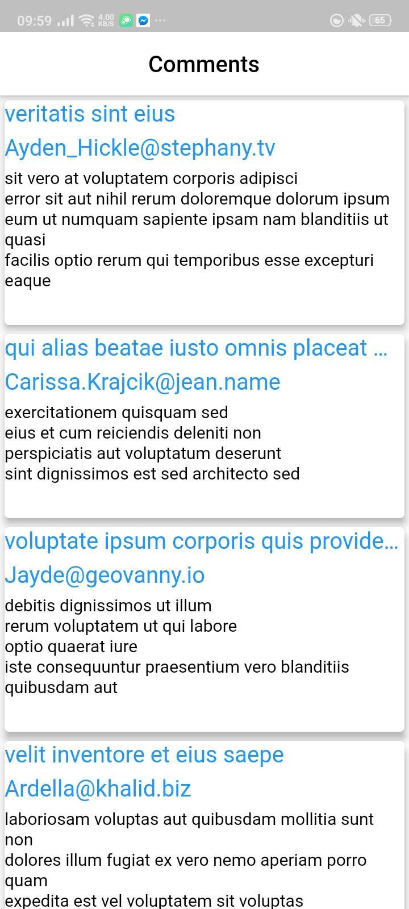

# UserList

A new Flutter project Created for the sake of Intern role at YIPL

## App Details
UserList is a simple App used to list out all the datas and features specified in the YIPL challenges.
All the app datas are fetched from the provided API.
Adding,Deleting and Updating Todo feature cannot be completed because the api doesn't allows to delete,
update and add the data on the api

## Home Page
App Fetches all the users present in the Api,and the values are cached in order to make the next cycle
much more faster, and displays them in our home page as shown below:

## Details Page
Upon selecting a particular user displayed in home page,the state of the app changes and a new state is loaded
which shows the details of selected user in attractive way as shown below:

## Posts Page
On clicking the Posts icon displayed on the top right corner of app, A new state is loaded and the posts posted by the
that particular user is displayed as show below:

## Comments Page
On selecting any posts displayed in posts page,Another new state gets invoked which displays the comments on that page
for that particular post, The top row contains the invidual's name who posted that comment, 2nd row contains the email
and similarly third row contains the body of the comment

## Albums Page
Now on clicking the album icon displayed on the bottom navigation bar, Album Page is loaded which shows all the albums
of that particular user,with the album title being dispalyed in each bar

## Photos Page
On selecting a particular Album, A new Photo Page is Navigated from Album page which displays all the photos contained in that
album as show below:

## Todos Page
Now on clicking the todo icon displayed on the bottom navigation bar,Todo page is loaded which displays all the Todos for that
User,

